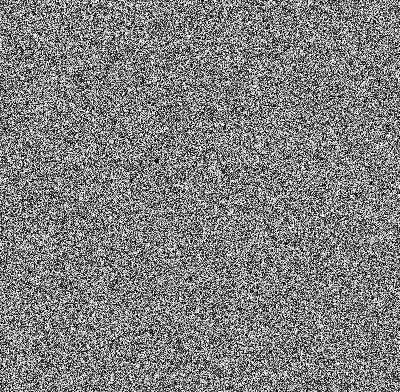
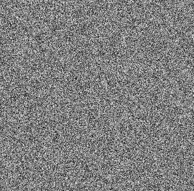
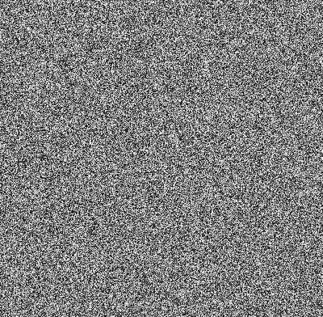
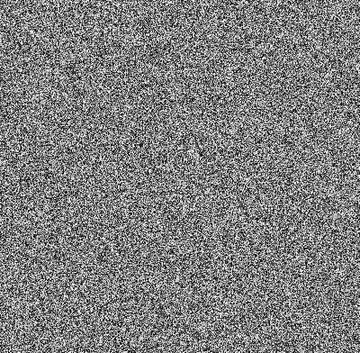

# secret_image_shamir-main

## Main idea about shamir secret method

* Shamir's Secret Sharing (SSS) is used to secure a secret in a distributed way.
* The secret is split into multiple parts, called shares. 
* These shares are used to reconstruct the original secret.
 
 
 # Original Image(Input)
 
 
 
 
 ## Encrypted Images
 
        

        

## Combining Encrypted Images(Output)

